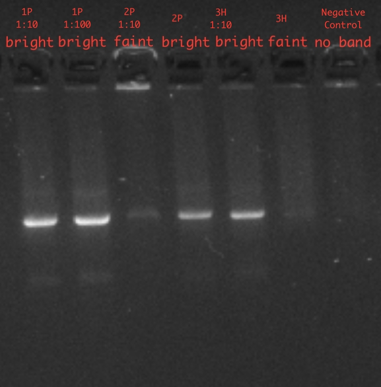
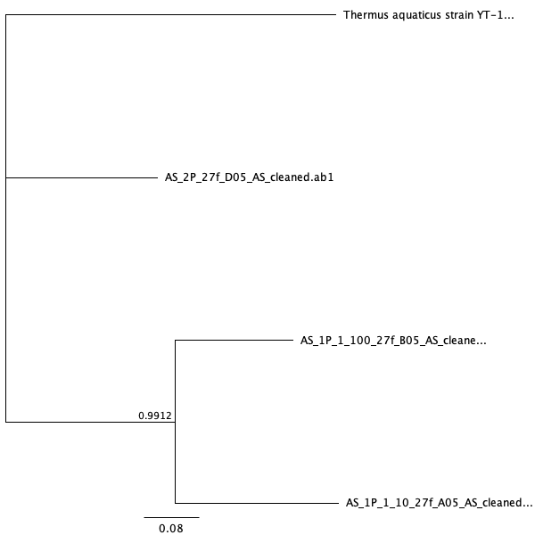
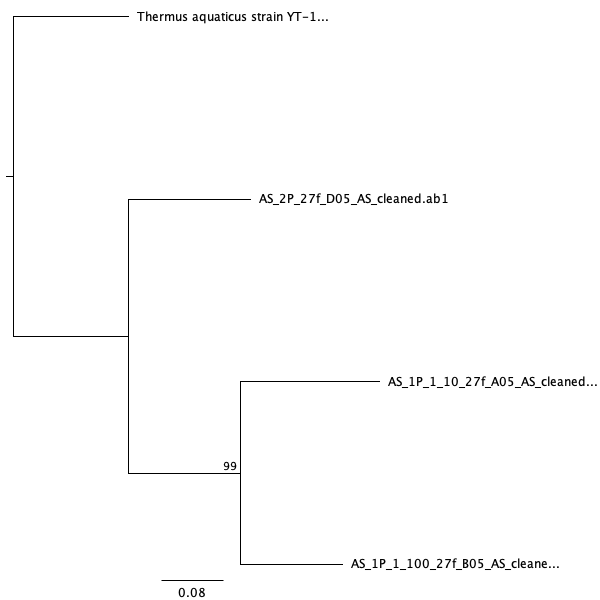

```{r setup, include = FALSE}
knitr::opts_chunk$set(echo = FALSE, message = FALSE, warning = FALSE)
```

# Introduction

Bacteria is found in high concentrations in built environments. Building design and its use has an affect on the type of microbial communities found in residential surfaces [@peccia2016buildings]. For example, a building that is used as a factory with a high number of occupants, animals, or crops found within it will have a different microbial community than a building that is kept sanitized such as a hospital. Some key factors that have been found to greatly affect the microbial community in resdential buildings include how moist the environment is, the age of the building, and whether or not animals are found within the building [@kettleson2015key]. Out of all rooms in a built environment, it has been found that bathrooms contain a higher concentration of bacteria than any other room due to bathrooms being a less ventilated room and a much more moist environment [@ojima2002hygiene]. In addition to the bacteria on surfaces in bathrooms, there is also a higher risk of bacteria exposed to humans via inhalation due to its moist environment [@azuma2013assessing]. In fact, research has shown that antibiotic-resistant _Staphylococcus_ bacteria are commonly found in indoor air of residential buildings and thrive in the moist environments of bathrooms [@rintala2008diversity]. It has also been found that skin associated bacteria are typically found on surfaces that have been touched by humans. Gut associated bacteria as well as fecal contaminants are typically found on the surface of toilets. This shows that human occupancy and human contact can have an affect on the microbial community within a surface area [@ramos2014tools]. This information also shows that bacteria doesn’t necessarily grow on surfaces found in built environments, but instead gets transferred onto it. Therefore, bacteria could be easily transmitted by means of simply touching a surface in a bathroom or restroom.


Research has shown that the overall highest concentration of bacteria in residential homes are found in moist areas such as bathroom sinks [@rusin1998reduction]. For this project I attempted to answer the following question, “Does the number of people getting in contact with a bathroom sink affect the diversity of the microbiome found within it?” I hypothesized that bathroom sinks in public restrooms will have a more diverse microbiome than the bathroom sinks in a residential home because of the higher number of people who have access to the public restrooms.

I have analyzed the microbiome of bathroom and restroom sinks. I compared the microbiome of bathroom sinks from residential houses to the microbiome of sinks in public restrooms. I used culture and dilution plates to obtain colony and morphotype abundance from each sink. Sequencing technology has been used in previous research to investigate indoor microbial communities [@flores2011microbial] and thus, I used Sanger sequencing and BLAST analysis to identify the organisms found from my samples. I further analyzed my results through the use of a software called Geneious Prime. Although culture and dilution plates showed that personal bathrooms have a higher abundance and diversity in bacteria, statistical results showed that my results were not significant and therefore were not enough to prove my hypothesis to be true.

Research has shown that next generation sequencing can provide insight into microbial genomes, the structure of the communities they inhabit, and their impact on human health and diseases [@10.1093/bfgp/els062]. I used Illumina next generation sequencing to provide an even broader range of information on the microbial communities and organisms from my environmental samples. Using an operating system called Bash command line, I was able to analyze the results from the Illumina sequence to gather more information on the organisms found within my environemental as well as culture samples. I created scripts in Bash to sort and analyze through the data that resulted from the Illumina sequencer. I found thousands of sequences in all but one environemental sample. The negative and positive controls also had thousands of sequences found within in. Most of the organisms found in my culture samples were, unexpectedly, not found in my environmental sample. This could mostly be due to contamination that may have taken place during the preparationf for Illumina sequencing.

This research is important because we spend most of our time indoors and especially in our homes. Being constantly exposed to the bacteria in our homes or public places can greatly influence our health. In fact, it has been found that roughly one in five human deaths are caused by pathogenic disease [@dunn2010global]. Previous literature has also found that there are roughly around 1415 species of infectious organisms that are pathogenic in humans [@taylor2001risk]. In order to prevent infection, we must first know the source of the bacteria and how humans come into contact with them. By knowing the structures of the microbial communities in everyday environments we can find ways of eliminating the bacteria that cause disease. However, there has been research conducted that shows a relationship between microbial communities in residential surfaces and methods of keeping the surfaces clean such as disinfectant sprays, natural products, etc [@rutala2000antimicrobial]. With that being said, there are emerging questions to follow up with such as whether or not antibacterial cleaning products can be correlated to the emerging number of drug-resistant bacteria [@aiello2005antibacterial]. By knowing how much bacteria is in a certain place we come into close contact with, such as bathroom or restroom sinks, we can then find ways of reducing any contamination that could lead to possible illness as well us come up with better ways to maintain proper hygiene within a restroom.

# Culture Methods

## Field Sampling

To obtain the samples I used for this experiment, I used sterile cotton swabs, sterile buffer, sterile gloves, and tubes. I swabbed the drains of bathroom sinks from three different residential homes as well as restroom sinks from three different public places. I obtained samples from my home, my cousin’s home, and a friend’s home to represent sinks from residential homes. For the public restrooms, I swabbed the restroom sinks at a Starbucks, Apple retail store, and a Burger King. This totalled to six distinct sites. I used a sterile swab and inserted it into the drain of a sink and moved it in a circular motion for approximately 10 seconds. I repeated the swabbing procedure for all the sinks at each of the six sites. This allowed me to obtain a total of 12 samples. I labeled the tubes from personal bathrooms as 1H, 2H, and, 3H. The tubes from public restrooms were labeled as 1P, 2P, and 3P. I used six samples, one sample from each location, for culturing. The other six environmental samples were set aside and frozen at -20 degrees Celsius and were later used for Illumina sequencing.

## Culture and Dilution Plates

I cultured and diluted the samples I obtained from the six different sites. The plates I used for culturing were made up of tryptic soy agar (TSA) medium on 100mm petri dishes. I added a sterile buffer, PBS, to one of the tubes containing a swab. I vortexed the tube for approximately 15 seconds. 100 uL of this solution was added to a culture plate and spread with beads. I then transferred 20 uL of the solution to another tube along with 180 uL of PBS. 100 uL of this second solution was added to a culture plate, spread with beads, and labeled as the 10x diluted plate. I did another dilution by adding 20 uL of the 10x solution to another tube and added another 180 uL of PBS. 100 uL of this solution was added to a culture plate, spread with beads, and labeled as the 100x diluted plate. I repeated this process with each of the six samples and obtained a total of 18 culture and dilution plates. The plates were incubated overnight at 37 degrees Celsius. The following day, the number of colonies and morphotypes were counted and documented.

## DNA Extraction 

After the colonies and morphotypes were counted and documented, I chose six different colonies to extract DNA from. I labeled 1.5 mL tubes for each sample. I added cells from one colony to a tube using a sterile pipette tip. I then followed the manufacturer’s protocol from the Sigma REDExtract-N-Amp kit. I then analyzed the DNA via Qubit analysis to quantify the DNA concentrations.

## PCR

For PCR, I had to first make the master mix. I calculated the volumes of reagents required for the mix. My calculations indicated that I needed 77 uL of AMP, 6.2 uL of 27f primer, 6.2 uL of 92r primer, 7.7 uL of BSA, and 49.3 uL of H20. After I created the master mix, I added 19 uL of the master mix into 7 tubes. 1 uL of DNA from each sample was added to a tube. I added 1 uL of H20 to the seventh tube to serve as the negative control.

I put the samples into a PCR thermocycler. The PCR cycle conditions began with five minutes of being in 95 degrees Celsius. I then set the thermocycler to undergo a cycle that started off at 94 degrees Celsius for 30 seconds, 65 degrees Celsius for 30 seconds, and 72 degrees Celsius for one minute. This was repeated for ten cycles and the temperature was stepped down by 1 degree per cycle. I changed the thermocycler again and set the temperature to 94 degrees Celsius for 30 seconds, 55 degrees Celsius for 30 seconds, and 72 degrees Celsius for 1 minute. This was repeated for 25 cycles. I then changed the thermocycler temperature to 72 degrees Celsius for 10 minutes and the thermocycler was finally held at 4 degrees Celsius.


## Gel Electrophoresis 

The gel I used for my experiement contained 2% agarose gel and SYBR safe dye. 4 uL of our DNA samples were loaded onto a 50 well gel. I used ladders to serve as a positive control at each end of the wells. I ran the gel under 140V and X TAE buffer conducted current through the gel.

## Sanger Sequencing

After checking for successful amplification using gel electrophoresis, PCR products were cleaned with ExoSAP (Invitrogen) and sent for unidirectional Sanger sequencing at MCLAB (South San Francisco, CA) using the 27f primer.


## Data Analysis 

The alignment program I used to analyze the Sanger sequences is a software called Geneious Prime. I received the results from Sanger sequencing as a zip file. I imported my files to Geneious and was able to analyze my sequences. I confirmed which sequences failed as well as sequences that failed but were usable for BLAST. Using trimmomatic, I cleaned up and trimmed the sequences that I confirmed to be usable for BLAST and used IUPAC ambiguity codes for bases that were hard to identify. I trimmed the sequences based on the color exhibit on Geneious Prime. The nucleotide bases that were labeled witha light blue color indicated a good read. The darker blue and red colors indicated a low quality read. For the darker blue labeled nucleotides, I used IUPAC ambiguity codes to replace the nucleotide in question. The beginning and ends of the sequences were mostly dark blue and red and thus I cut them off due to its low quality.

I used a software called BLAST to match my samples to organisms that were in NCBI's nucleotide database. Multiple organisms were shown from the BLAST results and I chose the top result. I also used Geneious to create a Bayesian phylogeny and a Maximum Likelihood phylogeny. _Thermus aquaticus_ was used as an outgroup for both phylogenies. I created the phylogenies using multiple sequence alignments generated using MAFFT. I installed MrBayes software in Genious Prime to create the Bayesian phylogeny [@huelsenbeck2001mrbayes]. I also installed PhyML software to create the Maximum Likelihood phylogeny. A minimum of three sequences were required in order to successfully create both phylogeny trees.

# Culture Free Methods For Environmental Samples

## DNA Extraction

After the initial six samples were sequenced via Sanger sequencing, the other six were taken out of the freezer to be prepared for Illumina sequencing. I followed the manufacturer’s protocol from the Sigma REDExtract-N-Amp kit. I then analyzed the DNA via Qubit analysis to quantify the DNA concentrations.

## PCR

To prepare the samples for PCR, I calculated the reagents required for the master mix. The reagents required for the master mix are AMP, 16sF and 16sR primers, BSA, template, and water. I prepared enough master mix to include 17uL in a PCR tube along with 1uL of DNA.

I put the samples into a PCR thermocycler. The cycle began with three minutes of being in 96 degrees Celsius. The thermocycler was changed to undergo 95 degrees Celsius for 30 seconds, 55 degrees Celsius for 30 seconds, and 72 degrees Celsius for 30 seconds. This was repeated for 25 cycles. The thermocycler was then set to 72 degrees Celsius for 5 minutes before being held at 4 degrees Celsius.

## Gel Electrophoresis

The gel I used for my experiement contained 2% agarose gel and SYBR safe dye. 4 uL of our DNA samples were loaded onto a 50 well gel. I used ladders to serve as a positive control at each end of the wells. I ran the gel under 140V and X TAE buffer conducted current through the gel.

## Illumina Sequencing

Following electrophoresis, PCR products were purified using AmpureXP magnetic beads (Beckman-Coulter) and quantitated using a PicoGreen fluorescent assay (Invitrogen) on a Tecan Infinite M Plex plate reader. Purified PCR products were used as the template for a second round of PCR, which served to attach unique pairs of forward and reverse Illumina barcodes (Nextera XT Index 2 kit). All other components of the PCR mixtures were as for the first-round PCR. These reactions were cycled at 95 degrees C for 3 minutes, then 8 cycles of: 95 degrees C for 30 s, 55 degrees C for 30s, and 72 degrees C for 30s, followed by a 5 minute elongation cycle at 72 degrees Following this amplification, PCR products were purified and normalized with a SequelPrep normalization plate (Invitrogen), pooled, and then quantified once again with a Qubit 4 fluorometer (Invitrogen) and a TapeStation 4200 (Agilent) to verify library size and concentration. This library was then diluted to the loading concentration (50 pM) and combined with an Illumina PhiX spike-in library (5% spike in) and sequenced on an Illumina iSeq using a 2 x 150 bp consumable cartridge.

## Data Analysis

I used the Bash operating system to analyze the data that resulted from the Illumina sequencing. I created scripts to assess the quality of the data, toss out bad sequences, clean other sequences, convert files to the correct format, and finally BLAST the data in order to get information on the organisms present in my environmental samples. The sequences were trimmed and cleaned to provide more accurate DNA sequences from my environmental samples. The files needed to be converted from fastq to fasta format because BLAST analysis only works with fasta formatted files. The organism match was based off NCBI’s nucleotide database. I ran the scripts using tmux in order to allow the code to continue running even after I disconnected from the server. 

# Results

## Culture Samples

Results from the bacteria cultures showed that personal bathrooms contained too many colonies to count. For the purpose of this experiement, I documented that I counted 1000 colonies from the plates that were uncountable. I used  a high value to represent the high abundance of colonies because it allowed for calculations and analysis of the data. The colony abundance from the 10x dilution of samples from each of the sites were compared to one another (Figure 1). Wilcox test showed a p-value of 0.35. The number of morphotypes that I counted from the samples ranged from 1-6. The morophotypes of the 100x dilution samples from personal bathrooms and public restrooms were compared to one another (Figure 2). Wilcox test showed a p-value of 0.1

The gel electrophoresis worked on all samples. Four of the six samples showed bright bands whereas the other two showed faint bands.The gel image showed no bands under the negative control (Figure 3). The DNA used in gel electrophoresis was quanitified via Qubit analysis (Figure 4).

After recieving the results from Sanger sequencing, I cleaned the sequences using Geneious. The negative control and 3H samples failed and were unusable for BLAST. Samples 3H 1:10 and 2P 1:10 failed the sequencing, however, I found the sequences to still be usable for BLAST. Samples 2P, 1P 1:100 and 1P 1:10 were cleaned, trimmed, and usable for BLAST (Figure 5).

The BLAST results indicated which organisms were found in my samples (Figure 6). I found a match for three of my samples, 2P, 1P 1:100, and 1P 1:10. Two of my samples, 3H 1:10 and 2P 1:10 resulted with no match. From the blast results I found that my 2P sample matched with _Bacillus licheniformis_, 1P 1:10 matched with _Acidovorax temperans_ strain R-C-TGW, and 1P 1:100 matched with _Citrobacter freundii_ strain.


I chose three samples 2P, 1P 1:100, and 1P 1:10 to be incorporated into phylogenies; a Bayesian phylogeny and a Maximum Likelihood phylogey. _Thermus aquaticus_ was used as the outgroup for both phylogenies. Bayesian phylogeny (Figure 7) was created to show the relationship between organisms. The Bayesian posterior probability was 0.9912. AS 1P 1:10 and AS 1P 1:100 were grouped together in a monophyletic clade. Maximum Likelihood phylogeny (Figure 8) was created to show the relationship between organisms. The Maximum Likelihood bootstrap value was 99. AS 1P 1:10 and AS 1P 1:100 were grouped together in a monophyletic clade in this phylogeny tree as well.

```{r load-libraries}
library("ggplot2")
library("dplyr")
library("tidyr")
library("readr")
library("broom")
library("knitr")
```

```{r read-in-culture-data}
# read in the culture data from csv
culture_data <- read_csv(
  "data/raw_data/raw_culture_count_data/BIOL422_culturing_data.csv")
```

```{r filter-and-plot-abundances}
# filter out only my 100x dilutions and make a boxplot
culture_data %>%
  filter(student_name == "Adelle Sumabat") %>%
  filter(dilution_1_10_or_100 == "10") %>%
  ggplot(aes(x = sample_group,
             y = number_of_colonies)) +
  geom_boxplot() +
  ggtitle("Comparison of colony abundances between Personal Bathrooms",
                "and Public Restrooms, 10x dilution") +
  xlab("Sample Group") +
  ylab("Number of Colonies")
```

**Figure 1:** Boxplot of colony abundances at different sites, 10x dilution. Despite a higher median number of colonies from Personal Bathroom samples, the mean numbers of colonies were not significantly different between the two sites. (Wilcox p = 0.35).

```{r abundances-stats}
# run a statistical test to compare the two groups of abundances
culture_data %>%
  filter(student_name == "Adelle Sumabat") %>%
  filter(dilution_1_10_or_100 == "10") %>%
  wilcox.test(data = .,
              number_of_colonies ~ sample_group) %>%
  broom::glance(x = .) %>%
  knitr::kable()
```

```{r filter-and-plot-morphotypes}
# filter out only my 100x dilutions and make a boxplot
culture_data %>%
  filter(student_name == "Adelle Sumabat") %>%
  filter(dilution_1_10_or_100 == "100") %>%
  ggplot(aes(x = sample_group,
             y = as.numeric(number_of_morphotypes))) +
  geom_boxplot() +
  ggtitle("Comparison of morphotypes between Personal Bathrooms",
                "and Public Restrooms, 100x dilution") +
  xlab("Sample Group") +
  ylab("Number of Morphotypes")
```

**Figure 2:** Boxplot showing the number of morphotypes from the two different sites, 100x dilution. There was no difference in the mean number of morphotypes (Wilcox p=0.1).

```{r morphotypes-stats}
# run a statistical test to compare the two groups of abundances
culture_data %>%
  filter(student_name == "Adelle Sumabat") %>%
  filter(dilution_1_10_or_100 == "100") %>%
  wilcox.test(data = .,
              as.numeric(number_of_morphotypes) ~ sample_group) %>%
  broom::glance(x = .) %>%
  knitr::kable()
```



**Figure 3:** Gel image from gel electrophoresis. Image was cropped and annotated to show only my data.

| Sample   | DNA concentration (ng/uL) |   |   |   |
|----------|---------------------------|---|---|---|
| 1P 1:10  | 8.51                      |   |   |   |
| 1P 1:100 | 7.80                      |   |   |   |
| 2P       | 16.00                     |   |   |   |
| 2P 1:10  | 49.70                     |   |   |   |
| 3H 1:10  | 16.40                     |   |   |   |
| 3H 1:100 | 6.33                      |   |   |   |

**Figure 4:** DNA concentration results obtained from Qubit analysis. 2-50 ng/uL was considered to be a good range for DNA concentration.

| Orignial File Name      | File Name After Cleaning               | Usability | Length After Trimming | Number of Corrections |
|-------------------------|----------------------------------------|-----------|-----------------------|-----------------------|
| AS_neg_27f_G05.ab1      | AS_neg_27f_G05_AS_failed.ab1           | unusable  | 5                     | 0                     |
| AS_3H_27f_F05.ab1       | AS_3H_27f_F05_AS_failed.ab1            | unusable  | 5                     | 0                     |
| AS_3H_1_10_27f_E05.ab1  | AS_3H_1_10_27f_E05_AS_failed_blast.ab1 | usable    | 706                   | 0                     |
| AS_2P_27f_D05.ab1       | AS_2P_27f_D05_AS_cleaned.ab1           | usable    | 247                   | 3                     |
| AS_2P_1_10_27f_C05.ab1  | AS_2P_1_10_27f_C05_AS_failed_blast.ab1 | usable    | 299                   | 0                     |
| AS_1P_1_100_27f_B05.ab1 | AS_1P_1_100_27f_B05_AS_cleaned.ab1     | usable    | 574                   | 2                     |
| AS_1P_1_10_27f_A05.ab1  | AS_1P_1_10_27f_A05_AS_cleaned.ab1      | usable    | 507                   | 0                     |

**Figure 5:** Locus of each 16S sequence, its usability, and sequence length after trimming.

| Sample ID   | Organism                            | Query Cover | E Value   | Percent Identity | Accession  |
|-------------|-------------------------------------|-------------|-----------|------------------|------------|
| AS 1P 1:10  | Acidovorax temperans strain R-C-TGW | 99%         | 0.0       | 99.60%           | MG982481.1 |
| AS 1P 1:100 | Citrobacter freundii strain         | 100%        | 0.0       | 99.48            | MN416243.1 |
| AS 2P       | Bacillus licheniformis              | 100%        | 6*10^-118 | 98.00%           | MK737917.1 |
| AS 2P 1:10  | No good match                       | N/A         | N/A       | N/A              | N/A        |
| AS 3H 1:10  | No good match                       | N/A         | N/A       | N/A              | N/A        |
| AS 3H       | Sequence failed                     | N/A         | N/A       | N/A              | N/A        |

**Figure 6:** BLAST result metrics which indicate the microorganisms found from my samples. AS 2P 1:10 and 3H 1:10 were failed sequences, however, I still considered them to be usable for BLAST. BLAST showed no match for the two samples. AS 3H was a failed sequence and did not undergo BLAST.




**Figure 7:** Bayesian phylogeny with _Thermus aquaticus_ as an outgroup. Bayesian posterior probablity of 0.9912



**Figure 8:** Maximum likelihood phylogeny with _Thermus aquaticus_ as an outgroup. Maximum Likelihood bootstrap value of 99.

## Environmental Samples

Qubit analysis confirmed that there was enough DNA concentrations to sequence in all six of my environmental samples. Results from the Illumina sequencer showed many sequences found within each environmental sample. Prior to trimming, the sample labeled 1H was found to have a total of 6389 sequences, 1P had 8816 sequences, 2H had 4581 sequences, 2P had 14 sequences, 3H had 10579 sequences, and 3P had 5808 sequences. The negative control sample labeled neg1 had 10990 sequences, neg2 has 3290 sequences, neg3 had 13837 sequences, neg4 had 7825 sequences. The positive control labeled zymo1 had 5236 sequences prior to trimming, zymo2 had 4139 sequences, zymo3 had 8448 sequences, and zymo4 had 9287 sequences. After trimming the sequences from the samples 1H ended up having 6137 sequences, 1P had 8463 sequences, 2H had 4404 sequences, 2P had 4 sequences, 3H had 10148 sequences, and 3P had 5552 sequences. 

_Acideovorax temperans_ was found in the 1P environmental sample along with 71 other strains of _Acidovorax_. _Citrobacter freundii_ was not found in the 1P environmental sample.  _Bacillus licheniformis_ was not found in the 2p environmental SAMPLE.

# Discussion

For this experiment I intended to determine if the number of people getting in contact with a bathroom sink affects the diversity of the microbiome found within it. After some research, I hypothesized that bathroom sinks in public restrooms will have a more diverse microbiome than the bathroom sinks in a residential home because of the higher number of people who have access to it.

The colony and morphotype abundance from my samples have showed that bathroom sinks used in personal homes have a much more diverse microbiome than sinks used in public restrooms. After a day of incubation, the colony abundance from seven out of the nine culture and dilution plates from personal bathroom sinks were so high that they were uncountable. I did, however, replace the data to show that there were 1000 colonies to allow for computation and analysis. However, statistic results exhibited a high p-value for both colony abundance and number of morphotypes thus indicating that I failed to reject the null hypothesis. Therefore, my results show that they are not significant enough to prove that bathroom sinks in public restrooms will have a more diverse microbiome than the bathroom sinks in a residential home. Failure to reject the null could be due to many reasons.

One reason that may explain my results could be the time at which I obtained my samples from the six locations. I collected samples from bathroom sinks from three different homes as well as bathroom sinks from three different restrooms. When I obtained the samples from the bathroom sinks representing sinks from residential homes, I had done so in the morning after people living in the household have already finished using the bathroom to wash their hands, wash their faces, brush their teeth, etc. I also went to the public restrooms right when the locations opened and therefore, it is likely that no one was able to use the restroom and sink yet that day.

Another reason could be that the bathroom and restroom sinks that I sampled were cleaned at different times. For example, I work at Apple Stonestown and cleaners come in every few hours to deep clean the restrooms and breakroom in the store. In my house, the bathroom does not get cleaned until late afternoon or at the end of the night every other day. The differences in cleaning patterns could have also affected the results of my experiment.

For this experiment I assumed that a higher number of people come into contact with sinks located in public restrooms, however, I obtained samples at a time when little to no one has yet even entered the restroom. Although more people have access to public restrooms, it does not necessarily mean they actually get in contact with it. The bathroom sinks I sampled may also have different cleaning patterns.

Three of my samples matched with an organism via BLAST. My sample labeled 2P matched with _Bacillus licheniformis_. After further research I found that _Bacillus licheniformis_ is commonly found in soil and bird feathers. It is not a human pathogen. _Bacillus lichenformis_ actually plays a role in nutrient cycling. A peer reviewed article explains that this bacteria is used in the biotechnology industry to manufacture enzymes, antibiotics, biochemicals and consumer products [@rey2004complete]. It is interesting to see that this organism matches with my sample 2P. I took this sample from a public restroom at Apple  Stonestown. Although Apple is a technology company, it does not contribute to biotechnology so it did not make sense to come across this organism at that location. It is possible, however, that a person that works in biotechnology and is exposed to this organism came to the store and washed his or her hands in the restroom sink.

The sample labeled 1P 1:10 matched with _Acidovorax temperans_ strain R-C-TGW, a gram negative bacterium that is known to cause disease in plants. This bacteria is normally found in soil and water environments. It is known to cause disease in plants, mostly watermelons and honeydews.

The sample labeled 1P 1:100 matched with _Citrobacter freundii_ strain, a bacteria known to cause a number of “opportunistic infections.” This means that this bacteria does not necessarily infect healthy people, but it infects people with previously weakened immune systems. Those who have a weak immune system and become infected by _Citrobacter freundii_ are prone to urinary tract infections,  intestinal infection, infections in respiratory tract, blood, or meningitis [@ranjan2013citrobacter]. Research has shown that some _Citrobacter_ strains that can cause meningitis and brain abscess. It is actually quite alarming to see this bacteria present in my samples because experiments show that it is capable of crossing the blood-brain barrier and thus is able to invade and replicate within brain cells [@badger1999citrobacter].

1P 1:10 and 1P 1:100 are samples I obtained from swabbing a public restroom sink in Burger King. Burger King sells food, therefore, I am able to make sense as to how and why a bacteria that causes disease in crops was found in the sink. However, it surprises and also worries me to see that bacteria that can cause many kinds of infections is present in a public restroom sink. I later found that the Burger King that I took a sample from was also right next to a gas station that had no restrooms. It is possible this Burger King may have a higher number of users than normal being next to a busy gas station that provided no restrooms for its customers.

For the results I received back from Sanger sequencing, three of my samples were sequenced successfully. I was able to clean, trim, and match the samples to organisms using BLAST. Two of the samples failed meaning that the sequences I obtained were of extremely low quality but were still usable for BLAST, however, BLAST analysis showed no match for those samples. The sequences could have just been too noisy for BLAST to be able to match an organism to it. One of my samples completely failed and was unusable. The sequence looked exactly like that of the negative control. For the three sequences that failed, it could have been due to either contamination of the samples somewhere throughout the procedure. The samples could have also contained DNA from more than one individual and thus resulted in messy sequences that had no match in the NCBI nucleotide databse. Throughout the experiment, I also found that some of the pipettes that I used were calibrated a bit differently from others. That caused me to redo certain steps throughout the  experiment which may also have potentially affected my data. It is also possible that I could have been using contaminated pipette tips throughout certain parts of the procedure.

Based on the fastqc reports, the quality of my environmental sample sequences were high. For all six environmental samples, the quality was shown to be at its lowest at the 150-151 position or the end of the sequences. However, it still protrayed high quality based on the "Per base sequence quality" chart. The quality of the sequences were confirmed after trimming the sequences via Bash commandline. Out of the thousands of sequences found in each sample, only a few hundred sequences from each sample were "thrown out" after running the code to trim and clean the sequences. The environmental sample from site 2P had the lowest count of sequences with a count of 14. As mentioned earlier, the 2P sample was from a restroom at Apple Stonestown which has cleaners coming in almost every hour to clean and disinfect the restrooms, break room, etc. Since I came in the morning, the restroom was still fresh from the morning cleaners. This can explain the significantly low amount of sequences found in the sample taken from this site.

The results from the Illumina sequences were not as I had expected. I found thousands of sequences from different organisms within each sample, including the positive and negative controls. Because Illumina sequencing is suppose to extract essentially all the organisms found in a sample, whatever I found in my culture samples should also be found in my environmental samples. Although, _Acidovorax temperans_ was indeed found in the environmental sample labeled 1P, _Citrobacter freundii_ was not. Both organisms were found in my cultured 1P samples via BLAST analysis. This tells me that _Acidovorax temperans_ is a bacteria that was found and obtained from the restroom sink from the 1P site and _Citrobacter freundii_ could be a contaminant in my culture samples. There were 71 strains of _Acidovorax_ found in my 1P environmental sample which gave me more assurance that the bacteria is truly obtained from the environmental sample and not a contaminant.  _Bacillus lichenformis_ was another organism found from my culture sample from the 2P site that was not found in the environmental sample. This again shows that _Bacillus lichenformis_ is actually an organism that may have contaminated my culture sample from the 2P site at some point during my procedure. I found thousands of sequences from different organisms within each sample, including the positive and negative controls. Even after trimming, the positive and negative controls exhibited a high number of sequences in the thousands range. The sequences found in the controls could possibly be due to contamination that must have taken place sometime during the preparation for the sequencer. If this experiement and procedures were to be repeated, I recommend taking caution to avoid any contamination among the samples.

If I were to do further research, I would take a larger number of samples. I would also take into consideration variables which I didn't think about prior to this experiment. The variables I would consider would be things like cleaning patterns of the bathrooms and restrooms (when and how often they are cleaned), the time of day I decide to obtain my samples, and stricter sterility to ensure no contaminants throughout the experiment.

This research has expanded my knowledge of microbial communities in bathroom and restroom sinks. It has given me insight on the types of microorganisms found within surfaces that I and many others come to close contact with on a daily basis. By understanding the genetic structures of bacteria found in everyday environment we can also find ways to understand their mechanisms in infection and causing disease as well as how they have become resistant to disinfectants and even drugs. Previous literature has found that surfaces that have not been cleaned and maintained pose great risk of infectious disease [@reynolds2005occurrence]. This was also portrayed in my experiment seeing that a well kept public restroom such as Apple exhibited much less bacteria than the bathroom in personal homes that were not yet clenaed at the time of field sampling. This means that maintaining a clean environment is neccessary to ensure our wellbeing. It is important to know the possible organisms we come into contact with to prepare for potential illness that may arise. There are papers written on the importance of ownership when it comes to fighting against disease [@tomori2014winning]. By taking ownership of microbial communities found in certain areas, we can then make the commitment to maintain proper hygiene and cleanliness to avoid becoming infected by pathogenic organisms.

# Sources Cited
